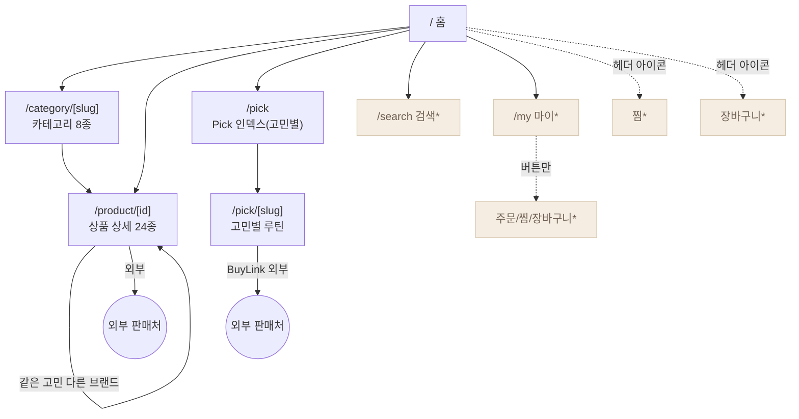
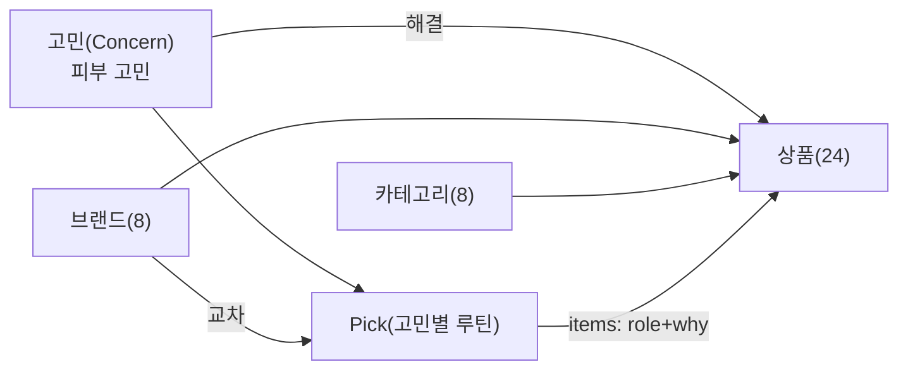
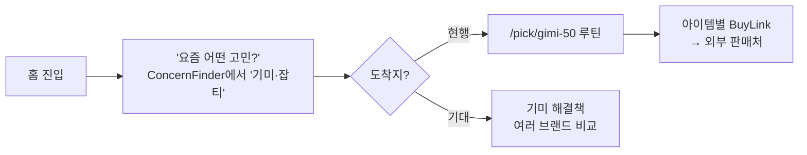
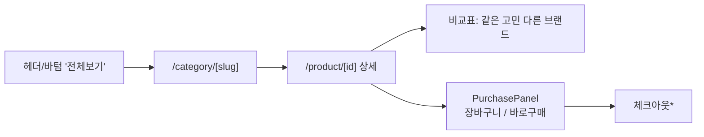
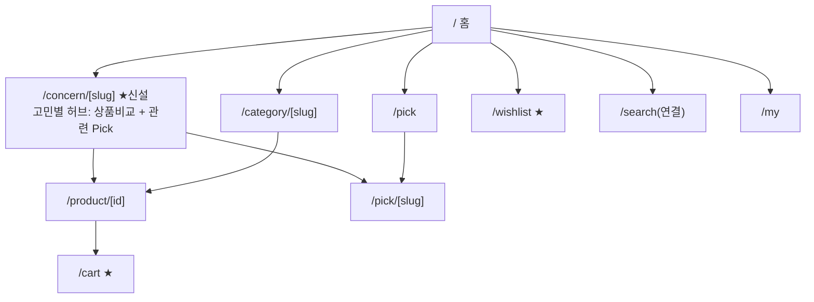

# 리베아(Rebea) — UX 구조 설계: IA & 유저 저니

> 작성일: 2026-07-27 · 근거: 실제 코드(`src/app`, `src/components`, `src/data`) 기준
> 목적: 유튜브 요약의 **"A. UX 프로세스 & 구조 설계"** 를 우리 앱에 실제로 적용.
> UX 프로세스 원칙: *기능 나열 → 화면 그리기* 가 아니라 **IA(구조) → 유저 저니(흐름) → 화면** 순으로 검증한다.

---

## 0. 제품 한 줄 정의
40대+ 여성을 위한 **"피부 고민별 기기＋화장품 큐레이션 마켓플레이스"**.
핵심 가치 = *고민(concern)을 고르면 여러 브랜드의 해결책을 한 곳에서 비교*.

**⚠️ 구조적 핵심: 앱 안에 판매 모델이 2개 공존한다.**
| 모델 | 화면 | 결제/전환 | 성격 |
|------|------|-----------|------|
| ① 직접 판매(마켓플레이스) | `/product/[id]` → PurchasePanel(장바구니·바로구매), 헤더 장바구니(뱃지 2), 적립P·무료배송 | **자체 장바구니/체크아웃** | 커머스 |
| ② 리베아 Pick(큐레이션) | `/pick/[slug]` → 각 아이템 `BuyLink`가 **외부 판매처**로 이동 | **외부 판매처(어필리에이트)** | 콘텐츠/추천 |

→ 이 둘이 내비게이션·저니에서 **언제 안으로(장바구니) 가고 언제 밖으로(외부구매) 가는지** 사용자에게 명확하지 않은 게 최대 이슈. (아래 3·4장)

---

## 1. 현행 IA (As-Is Sitemap)

`*` = **프로토타입에서 라우트/기능 미연결**(검색, 마이 메뉴, 헤더 찜·장바구니 아이콘엔 목적지 없음).

### 실제 라우트 표
| 경로 | 화면 | 상태 | 비고 |
|------|------|------|------|
| `/` | 홈 | ✅ | Hero·카테고리·추천·ConcernFinder·베스트·리뷰·브랜드·신상 |
| `/category/[slug]` | 카테고리(8) | ✅ | device·skincare·cover·wrinkle·mask·suncare·cleansing·inner |
| `/product/[id]` | 상품 상세(24) | ✅ | 갤러리·평점·가격·혜택·**PurchasePanel**·**비교표**·상세이미지 |
| `/pick` | Pick 인덱스 | ✅ | 고민 칩 → 앵커, 고민별 루틴 목록 |
| `/pick/[slug]` | 고민 루틴 | ✅ | 진단·선정기준·기기+화장품 조합·하루루틴·세트·공유 |
| `/search` | 검색 | ⚠️ 미연결 | 인기검색어 UI만 |
| `/my` | 마이 | ⚠️ 미연결 | 게스트, 메뉴 버튼만 |
| 헤더 찜/장바구니 | — | ❌ 없음 | `/wishlist`·`/cart` 라우트 부재 |

### 글로벌 내비게이션
- **헤더(데스크톱)**: 로고 · 검색바(폼 action="#") · 찜♥ · 장바구니(뱃지 2) · 카테고리 스트립(리베아 Pick + 8카테고리)
- **바텀 내비(모바일)**: 홈 / 전체보기(→`/category/device`) / 리베아 Pick / 검색 / 마이

---

## 2. 엔티티 & 택소노미 모델

- **Product**: `category`(1) + `concerns`(N) + `brandId` + `badge`(베스트/신상/단독/앵콜) + rating/price.
- **Pick**: `concern` 1개 = 여러 브랜드 상품을 **역할(role)** 로 묶은 루틴.
- **Concern = 브랜드 약속의 핵심 축**인데, **1급 내비게이션이 아님**(전용 `/concern/[slug]` 없음).

### 🔴 발견: "고민(concern)" 택소노미가 3곳에서 제각각
| 위치 | 고민 값 | 링크 목적지 |
|------|---------|-------------|
| `Product.concerns` | 처짐·탄력저하·주름·칙칙함·기미·잡티·건조·모공·민감 | (데이터 태그) |
| 홈 `ConcernFinder` | 주름 / 기미·잡티 / 탄력 저하 / 속건조 / 칙칙함 / 예민함 | 대부분 `/category/*`, "기미·잡티"만 `/pick/gimi-50` |
| `/pick` 인덱스 | pickConcerns(별도 세트) | `#앵커` |

→ 같은 "고민"인데 **명칭도 다르고(탄력저하 vs 탄력 저하 vs 처짐), 도착지도 category/pick/anchor 로 섞임**. 사용자는 "기미"를 골랐을 때 어떤 화면이 나올지 예측 불가 → 신뢰·일관성 훼손(요약 D·F의 "일관성=좋은 UX").

---

## 3. 핵심 유저 저니 (User Journeys)

주 사용자 = **50대 전후 여성, "요즘 부쩍 신경 쓰이는 고민(예: 기미) 하나"를 해결하고 싶다.** 아래 3개 흐름이 앱의 골격.

### 저니 A — 고민 기반 발견 → 비교 → 구매 (★핵심, 브랜드 약속 그 자체)

| 단계 | 사용자 행동 | 터치포인트 | 감정 | 이탈위험·피드백 갭 |
|------|-------------|-----------|------|-------------------|
| 발견 | "기미가 고민" 선택 | 홈 ConcernFinder | 기대 ↑ | 고민마다 도착지가 category/pick 로 달라 혼란 |
| 비교 | 여러 브랜드 해결책 비교 기대 | (기대) 고민 전용 화면 | — | **전용 화면 부재** — category로 빠지면 "비교" 약속이 옅어짐 |
| 결정 | 조합/제품 선택 | Pick 루틴 or 상품 상세 | 신뢰 | Pick은 외부구매, 상품상세는 자체 장바구니 → **경로 분기 혼란** |
| 구매 | 구매 | 외부 판매처 / PurchasePanel | 이탈/완료 | 외부로 나가면 재유입·적립 연결 끊김 |

### 저니 B — 카테고리 브라우징 → 상세 → 장바구니(자체 커머스)

| 단계 | 행동 | 감정 | 갭 |
|------|------|------|-----|
| 탐색 | 카테고리 훑기 | 편안 | 바텀 '전체보기'가 항상 device로 고정 진입(전체 아님) |
| 상세 | 혜택·평점·비교표 확인 | 신뢰 ↑ | 비교표 좋음(마켓플레이스 강점) |
| 담기 | 장바구니/바로구매 | 결정 | **장바구니·체크아웃 라우트 없음** → 담아도 확인 화면·피드백 없음 |

### 저니 C — Pick 큐레이션 소비 → 외부 구매 (어필리에이트)
`/pick` → 고민 칩 → `/pick/[slug]`(진단→선정기준→기기+화장품 조합→하루 루틴→세트→공유). 각 아이템 **외부 판매처로 이동**.
- 강점: "왜 이 고민인가 / 고른 기준 / 대가 안 받음" 명시 → **중립성·신뢰 설계가 훌륭**.
- 갭: 외부로 나가는 순간 **적립·장바구니·재유입 없음**. 저니 B(자체판매)와 목적이 충돌.

---

## 4. 구조적 이슈 & 개선안 (우선순위)

| # | 이슈 | UX 원칙(요약) | 개선안 |
|---|------|---------------|--------|
| P1 | **"고민"이 1급 축이 아님** + 명칭/도착지 불일치 | A.IA / 일관성 | `concerns` 마스터 목록을 `data`에 단일 정의 → `ConcernFinder`·Pick·상품태그가 **한 소스** 참조. 전용 라우트 **`/concern/[slug]`** 신설(그 고민의 상품+Pick을 함께 비교) |
| P2 | **판매 모델 2개(자체 vs 외부)가 뒤섞임** | A.유저저니 | 화면에서 경로를 명시: 상품상세=자체 구매, Pick=외부 이동임을 라벨로 구분. 목표(자체판매/추천) 중 **1차 전환을 결정**하고 저니를 그쪽으로 정렬 |
| P3 | **장바구니·찜·검색·마이가 목적지 없음** | "좋은 UX=피드백 준다"(요약 A) | `/cart`·`/wishlist` 라우트, 검색 결과 연결, 마이 메뉴 최소 동작. 담기 시 토스트/카운트 피드백 |
| P4 | 바텀 '전체보기'가 `/category/device` 고정 | 일관성/예측성 | 카테고리 **인덱스 `/category`** 또는 시트로 전체 노출 |
| P5 | 상품 상세 title "마춰케어" (브랜드는 리베아) | 신뢰/일관성 | 메타 title을 "리베아"로 통일 (별도 태스크로 분리) |

---

## 5. 권장 To-Be IA (고민을 1급 축으로)

핵심: **홈 → 고민 허브(`/concern`) → (비교) → 상품/Pick → 전환**. 브랜드 약속("고민 고르면 비교")이 내비게이션 1단에서 바로 실현되고, 판매 모델 분기도 이 허브에서 안내.

---

## 다음 액션 후보
1. `concerns` 마스터를 `src/data`에 단일 정의하고 3곳을 연결 (P1 첫걸음, 코드 작업)
2. `/concern/[slug]` 허브 페이지 프로토타입 (저니 A 실현)
3. 저니 B의 `/cart` + 담기 피드백(토스트) 최소 구현 (P3)

*이 문서는 구조 설계 산출물이며, 실제 화면 리팩터는 [디자인 토큰](src/design/tokens.ts)·타이포 스케일 위에서 진행합니다.*
